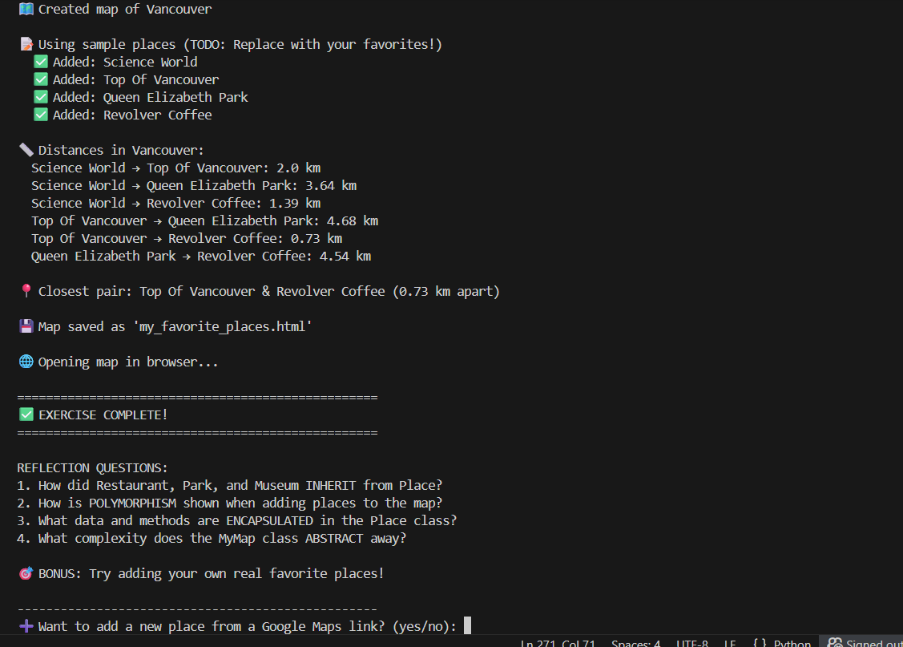
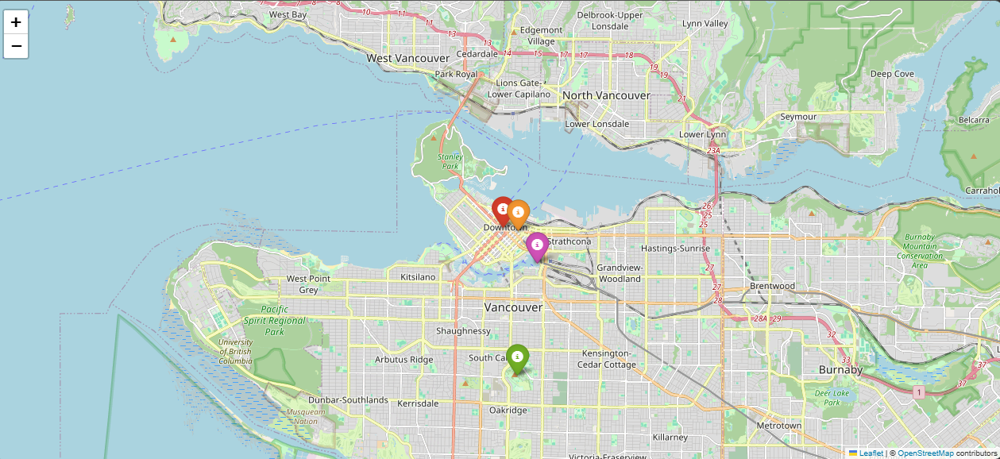

#  My Favorite Places Map — Workflow

A beginner OOP exercise that builds an interactive map of Vancouver using Python and `folium`.

---

## How It Works

### Step 1 — Run the script

When you run `ex.py`, the program:

1. Creates a `MyMap` object centered on Vancouver
2. Instantiates sample places — a `Museum`, `Restaurant`, `Park`, and `Cafe`
3. Adds each place to the map with a colored marker
4. Calculates distances between every pair of places
5. Finds and prints the two closest places
6. Saves the map as `my_favorite_places.html` and opens it in the browser

### Step 2 — Terminal output

The terminal walks you through every step as it runs:

- Each place is confirmed with ✅ as it gets added
- All pairwise distances are printed (e.g. `Top Of Vancouver → Revolver Coffee: 0.73 km`)
- The closest pair is highlighted: **Top Of Vancouver & Revolver Coffee (0.73 km apart)**
- At the end, the program asks: `➕ Want to add a new place from a Google Maps link? (yes/no)`

### Step 3 — Interactive map in the browser

The saved HTML file opens automatically and shows all your places as colored markers:

| Color | Place Type |
|-------|-----------|
|  $${\color{red}Red}$$| Restaurant |
|  $${\color{green}Green}$$| Park |
|  $${\color{purple}Purple}$$ | Museum |
|  $${\color{orange}Orange}$$ | Cafe |

some *blue* text.

Click any marker to see its popup with details (food type, playground info, entry fee, WiFi).

---

## Adding a New Place at Runtime

After the map saves, the program prompts you to add a new place using a Google Maps link:

1. Go to [Google Maps](https://maps.google.com)
2. Right-click any location → click the coordinates at the top to copy them
3. Paste as: `https://www.google.com/maps?q=49.2827,-123.1207`
4. Choose the place type (1 = Restaurant, 2 = Park, 3 = Museum, 4 = Cafe)
5. Enter the name and extra details
6. The map file is re-saved with the new marker added

---

## OOP Concepts Demonstrated

| Pillar | Where |
|--------|-------|
| **Encapsulation** | `Place` class bundles name, coordinates, and methods together |
| **Inheritance** | `Restaurant`, `Park`, `Museum`, `Cafe` all inherit from `Place` |
| **Polymorphism** | Each subclass overrides `get_popup_text()` and `get_marker_color()` differently |
| **Abstraction** | `MyMap` hides all `folium` complexity behind simple `add_place()` and `save()` calls |